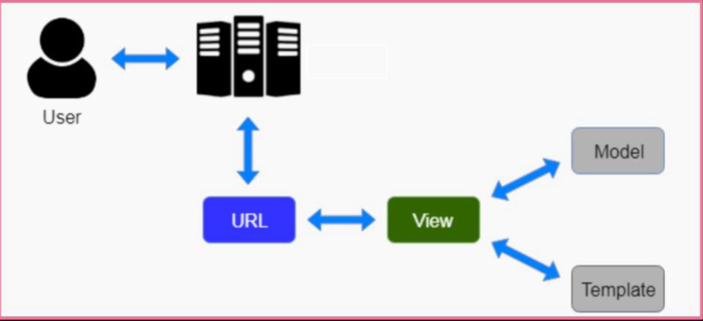

# Padrão MVT

Cada framework tem um padrão. O Django usa o MVT = Model View Template
Model - recebe a estrutura do Banco de Dados
View - responsável pela camada lógica
Template - responsável pelo frontend
> Todo o frontend vai ficar numa pasta chamada *Template*

> Outro padrão existente no mercado é o MVC = Model View Controller. O Controller responde as solicitações do usuário.
